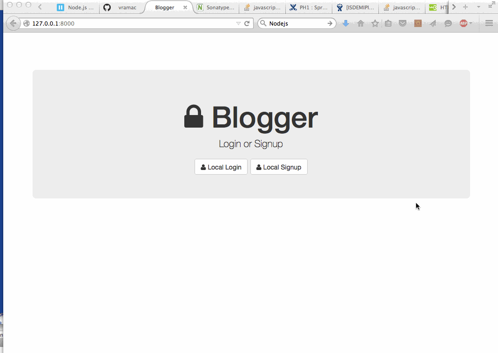
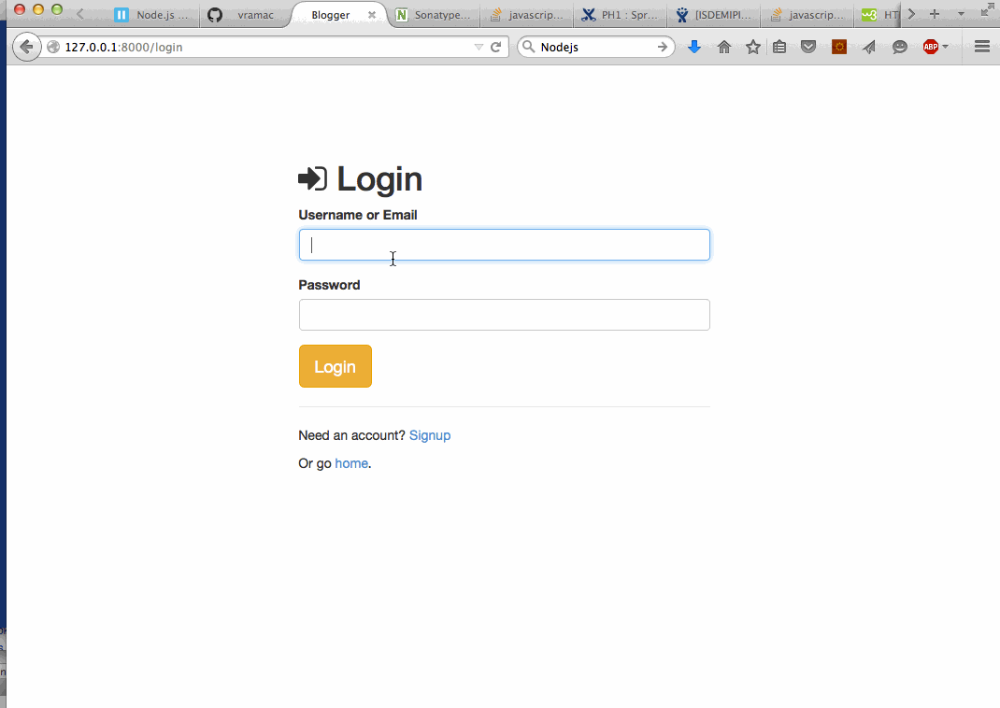

## Blogger

This is a basic Blogger clone to create a blog with comments.

Time spent: `20 hours`

### Features

#### Required

- [X] User can Signup, Login and Logout with input validation
- [X] Session and user accounts are persisted in a data store
- [X] User can create and edit a blog post
- [X] User can view blog posts with details on their Profile
- [X] User can view anyone's blog with posts at the specified url
- [X] User can comments on their blog posts on their Profile
- [X] Logged In users can comment on any blog post
- [X] Comments are viewable at the bottom of the associated blog post

Walkthrough

